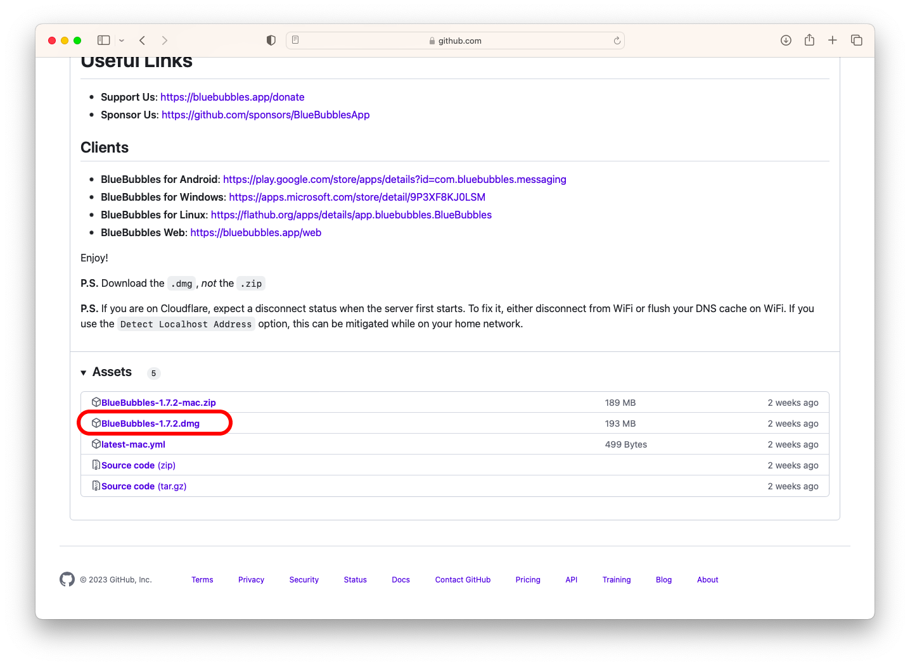
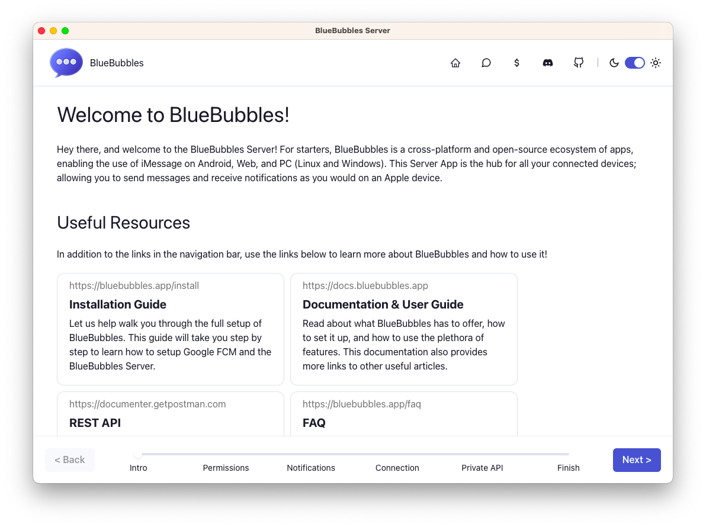
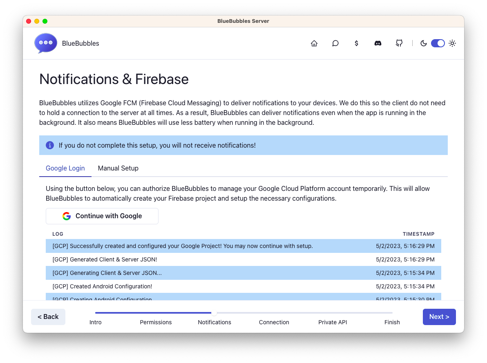
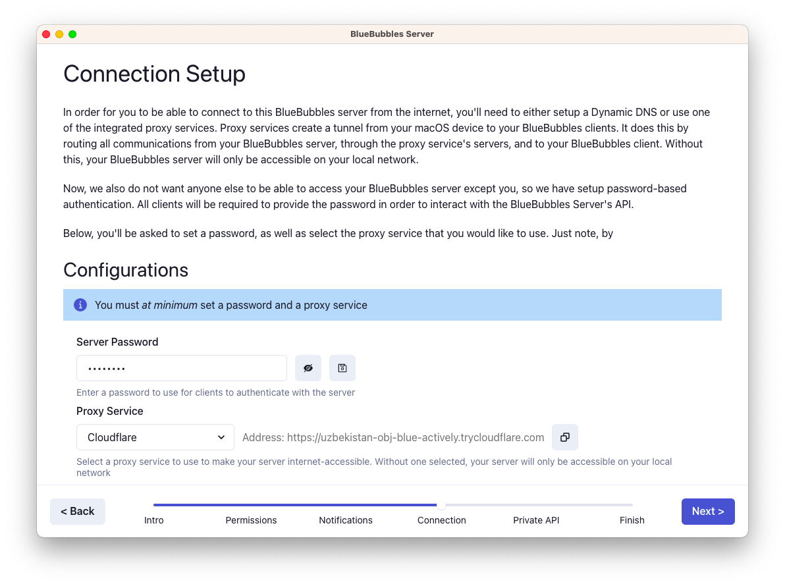

1. On the macOS device you'd like to use for the server, open the [server GitHub](https://github.com/BlueBubblesApp/bluebubbles-server/releases/latest). Scroll to the bottom and download the .dmg file.

   

2. Visit your Downloads folder in **Finder**. Locate the downloaded .dmg and right click (or Ctrl + Left click) the item to **Open** it. **NOTE: Do not access the downloaded .dmg from the Downloads Center on the Dock!**

3. Drag the app icon to the applications folder when prompted. Right click (or Ctrl + Left click) the popup to **Eject** it. Finally, open the app from the applications folder, and you will be greeted with the welcome screen.

   

4. Proceed through the Intro, and Permissions steps, following the on-screen guide to enable accessibility and full disk access. Note that accessiblity is **not required** for BlueBubbles to function.

5. Once full disk access is enabled, proceed to the Notifications step. Connect your Google account so we can provision a Firebase project for notifications.

6. You may configure Notifications via Google Firebase either automatically or manually. Use the "Continue with Google" button to automatically provision your Firebase project.

7. During the setup process, you may get a popup taking you to the Firebase Project Creation Page. You might need to accept a terms of service popup, or manually use the "Create a project" button to create your project.

8. If you used the "Create a project" button, click on the "name" field and select the "BlueBubbles" project. Click through the remaining screens to proceed. Then close the popup window.

9. Wait for the project creation to finish, as indicated in the logs below.

   

10. Proceed to the Connection step and add a strong server password. Make sure to use the floppy disk icon to save it.

11. In most cases, Cloudflare is the proxy service you should use. If you experience any issues with it, visit our [Discord](https://discord.gg/6nrGRHT) for troubleshooting instructions.

    

12. (OPTIONAL) Proceed to the Private API step and complete the setup using [our guide](https://docs.bluebubbles.app/private-api/installation).

13. Finally, finish the server setup and make any customizations you would like.
